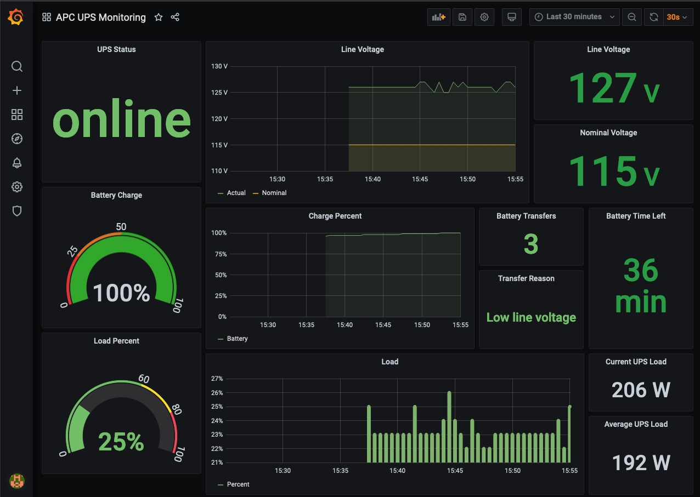
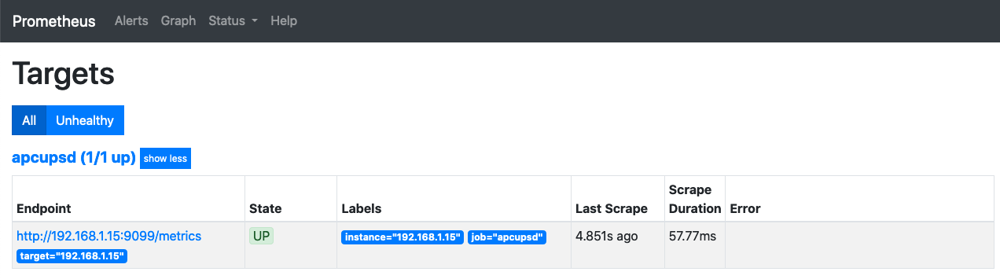

# apcups-exporter

Prometheus Exporter for APC UPS via apcupsd.

The exporter connects to a host running [`apcupsd`](http://www.apcupsd.org/). The exporter container can also be run in the same host.



## Configure the apcupsd daemon

In the host where the UPS is connected, install and configure the `apcupsd` daemon according to your UPS parameters (Device type and connection). Basic configuration for USB UPSs below:

Install:

```sh
sudo apt update && sudo apt install -y apcupsd
# Your Kernel needs CONFIG_USB_HIDDEV=y enabled. Check with zcat /proc/config.gz|grep HIDDEV
```

File `/etc/apcupsd/apcupsd.conf`:

```conf
UPSNAME Lab-UPS-1
UPSCABLE usb
UPSTYPE usb
DEVICE
NISIP 0.0.0.0
```

File: `/etc/default/apcupsd`:

```conf
ISCONFIGURED=yes
```

Enable and restart the daemon

```sh
#Enable and start the daemon
sudo systemctl enable apcupsd
sudo systemctl restart apcupsd
```

## Deploy the apcupsd-exporter

You can run the `apcupsd-exporter` in a container locally in the same machine running the `apcupsd` daeeon. Container needs to run in host network to access localhost daemon. Port has been overriden in command line with command `-listen-address :9099` at the end.

```sh
docker run --name apcupsd -d --net=host carlosedp/apcupsd-exporter:latest -listen-address :9099
```

Or run the exporter container on a different machine pointing to the `apcupsd` daemon address and port using HTTP parameters.

```sh
docker run --name apcupsd -d -p 9099:9099 carlosedp/apcupsd-exporter:latest -listen-address :9099

# Then curl passing parameters:
curl http://localhost:9099/apcupsd?target=192.168.1.15&port=3551
```

## Configuring Prometheus to scrape metrics

Sample Prometheus configuration (replace your exporter IP). Add to your `prometheus.yaml` file:

```yaml
...
  - job_name: 'apcupsd'
    static_configs:
      - targets:
        - 192.168.1.15 # host running apcupsd for a UPS
    metrics_path: /apcupsd
    params:
      port: [3551]
    relabel_configs:
      - source_labels: [__address__]
        target_label: __param_target
      - source_labels: [__param_target]
        target_label: instance
      - target_label: __address__
        replacement: 'ups-exporter:8080'  # APCUPSD exporter address
```

Check the Prometheus targets if the endpoint is being scraped.



And import the `apcups-dashboard.json` into your Grafana Deployment.


## UPS Status

The exporter lists two different types of status metric to be as flexible as possible.

1. `apc_status` has a label value of "status" which includes all the possible apcupsd status values, currently this results in the following for an "online" UPS:


2. `apc_status_numeric` is a single metric with value as per the following status table

| status        | value |
| ------------- | ----- |
| online        | 0     |
| trim online   | 1     |
| boost         | 2     |
| trim          | 3     |
| onbatt        | 4     |
| overload      | 5     |
| lowbatt       | 6     |
| replacebatt   | 7     |
| nobatt        | 8     |
| slave         | 9     |
| slavedown     | 10    |
| commlost      | 11    |
| shutting down | 12    |
